# 一、小组个人信息

组长：王浩(2013287)  
组员：王照钦(1911484)  
组员：王昕炜(2113426)  
组员：张麟浩(2113976)  
组员：李铭辉(2011266)  

备注：均为 0930 李起成老师班级。

# 二、项目概况

## （一）任务目标

本招聘网站项目的主要目标包括：

1. **用户注册与登录**：实现用户（求职者和招聘方）注册、登录、以及账户管理功能，包括用户信息的增删改查。
2. **职位发布与管理**：招聘方可以发布和管理职位信息，包括职位的分类、描述、要求等，并能够编辑和删除职位。
3. **求职功能**：求职者可以浏览、搜索并申请职位，并能够查看申请状态和历史记录。
4. **简历管理**：求职者可以创建、编辑简历。
5. **通知与消息**：系统提供通知功能，向用户推送招聘进展、面试安排等消息，同时提供站内消息功能，方便用户之间的交流。
6. **推荐系统**：实现职位推荐和简历推荐功能，帮助招聘方和求职者更快匹配合适的工作和人才。
7. **安全性与隐私保护**：保证用户数据的安全性和隐私保护，采用加密算法进行数据存储，防止数据泄露和滥用。
8. **用户体验**：提供良好的用户界面和用户体验，使用户能够方便快捷地完成所有操作。

## （二）用户特点

本系统的最终用户主要分为三类：求职者、招聘方和管理员。

- **求职者**：
  - 注册并创建个人账号。
  - 浏览和搜索职位信息。
  - 投递简历和查看申请进度。
  - 接收面试通知和系统推荐的职位信息。

- **招聘方**：
  - 注册并创建公司账号。
  - 发布和管理招聘职位。
  - 浏览和筛选求职者简历。
  - 通知求职者面试安排和录用信息。

- **管理员**：

  - 系统的整体管理与维护。
  - 管理用户账号，包括求职者和招聘方的注册申请审核、账号启用和禁用。
  - 监控系统运行状态，确保系统稳定和安全。
  - 审核和管理招聘信息，确保职位信息的合法性和真实性。
  - 处理用户反馈和投诉，提供技术支持。
  - 生成系统报告和统计数据，提供给决策层参考。

## （三）假定与约束

1. 系统运行的最小寿命：在无重大改动的情况下运行 3 年。  
2. 开发期限：120 天。  
3. 假设相关硬件设备齐全。  
4. 假设系统相关功能达到预期要求。  
5. 系统必须遵守数据保护和隐私法规，支持高并发访问，确保在用户高峰期依然能够稳定运行。  
6. 系统需要满足网络安全和信息安全的相关规定和要求，包括但不限于防止黑客攻击、数据泄露等方面的规定。

# 三、需求分析

## （一）业务描述

### 1.系统总业务流程图及其描述

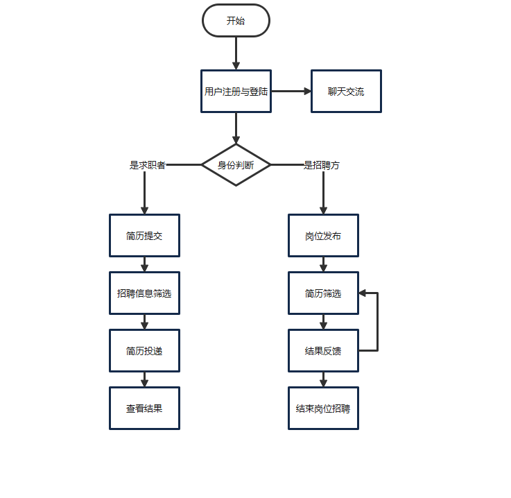

上述总业务流程图概述了招聘平台的核心操作流程。用户首先在平台上注册并登录，随后根据其身份（求职者或招聘方）进入不同的操作路径。求职者可以提交简历并根据个人条件筛选并申请职位，而招聘方则负责发布岗位需求并对收到的简历进行筛选。双方通过平台进行互动，求职者投递简历后，招聘方会根据岗位要求进行评估并给出反馈。这个过程不断进行，直到招聘方找到合适的候选人并结束岗位的招聘。此外，无论用户是求职者还是招聘方，都可以在聊天系统与他人交流、分享职位信息。

### 2.各个子业务流程图及其描述

#### （1）注册登录

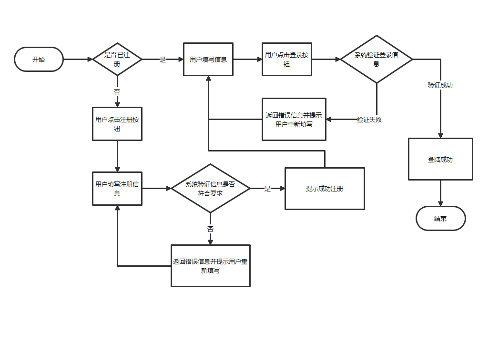

这张业务流程图展示了用户在进行登录和注册操作时的系统响应流程。当用户访问系统时，首先需要自行判断是否已经注册。如果已注册，用户将点击登录按钮并输入个人信息，系统随后验证这些信息。如果登录信息正确，用户将成功登录；如果不正确，系统会提示错误并要求用户重新填写。对于未注册的用户，他们将选择注册按钮并填写注册信息。系统将检查这些信息是否符合注册要求，如果符合，用户将被告知注册成功；如果不符合，系统同样会返回错误信息并要求用户重新填写。

#### （2）求职者
- 个人信息管理与简历编辑

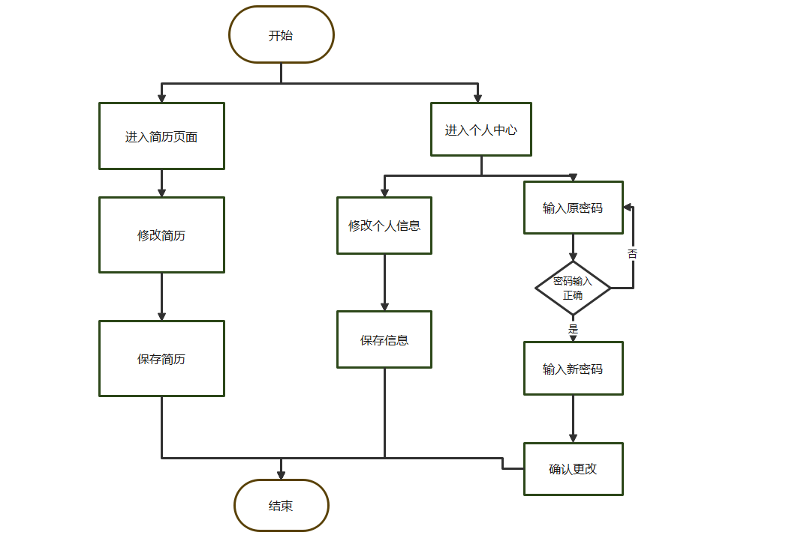

在求职者登陆后，可以进入个人中心，修改姓名、性别等个人信息。也可以进入修改密码界面，输入原密码确认成功后，可以输入新密码并确认密码，确认更改后保存新密码。此外，还可以访问简历编辑页面，编辑个人简历并保存。

- 投递简历

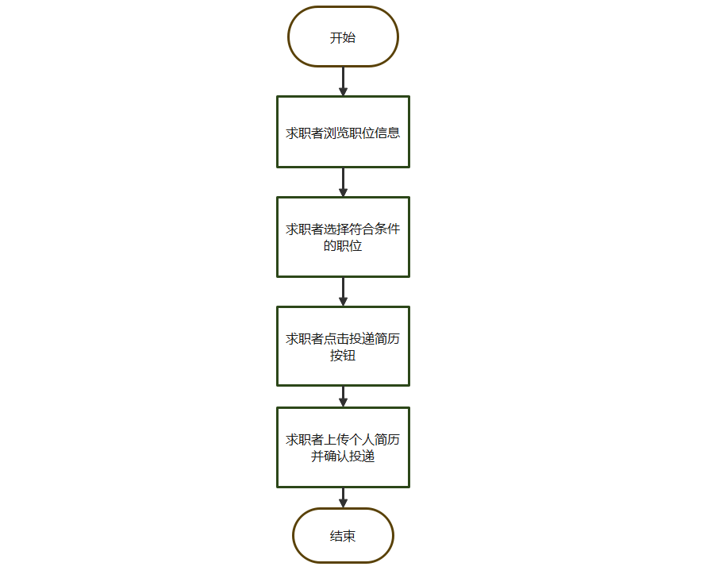

求职者首先浏览各种职位信息，寻找与自己资质和兴趣相匹配的岗位。一旦找到合适的职位，他们会点击投递简历的按钮，随后确认投递自己的个人简历。一旦投递完成，流程即告结束，求职者的简历便会被发送至招聘方进行审核。

#### （3）招聘方

- 个人信息管理

在招聘方登陆后，可以进入个人中心，修改密码，输入原密码确认成功后，可以输入新密码并确认密码，确认更改后保存新密码。此外，还可以访问公司信息编辑页面，编辑公司信息并保存。

- 职位发布

招聘方首先进入职位发布页面，然后详细填写包括职位描述、薪资待遇和工作地点在内的关键信息。点击发布按钮后，系统便会自动接收并存储这些信息。

- 招聘结果反馈

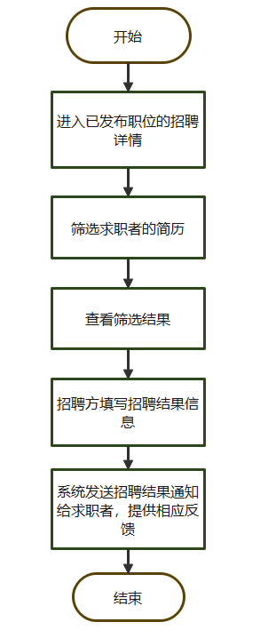

招聘方选择要查看详情的已发布职位，然后查看求职者的简历，然后填写相应的招聘结果反馈信息，例如录取、拒绝、进一步面试安排等。系统随后自动发送这些信息给求职者，并提供反馈，确保求职者及时了解申请结果。

- 管理已发布职位

招聘方首先进入系统查看已发布的职位列表，然后选择需要操作的职位。如果需要修改职位信息，点击修改按钮，进入编辑页面进行编辑，并在完成后确认修改。如果招聘方决定删除某个职位，则点击删除按钮，系统会弹出确认对话框以避免误操作。一旦招聘方确认删除或修改，流程结束，职位信息将相应地更新或从系统中移除。

## （二）数据需求

### 1.数据需求描述

(1) 用户（包括求职者、招聘方）信息，用于满足用户浏览和修改个人信息的需求。  
(2) 职位信息，用于用户查看职位。  
(3) 求职信息，用于满足求职者投递简历、招聘方查看求职者简历的需求。  
(4) 聊天记录信息，用于记录用户间交流信息。

### 2.数据流图

用户信息数据流图如下：

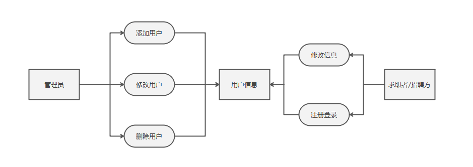

职位信息数据流图如下：

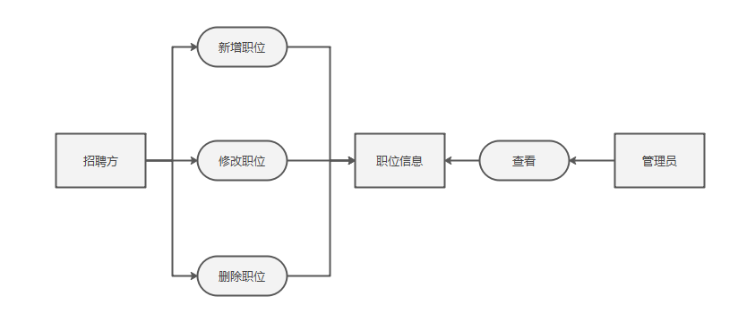

求职信息数据流图如下：

聊天记录信息数据流图如下：

### 3.数据字典

**(1) 求职者信息表（）**   
求职者 ID（）：唯一标识符，自增长。  
求职者姓名（Name）：字符串，最大长度为 50。  
性别（Gender）：字符串，最大长度为 10。  
......（包含简历信息）  
**(2) 招聘方信息表（）**  
招聘方 ID（）：唯一标识符，自增长。  
招聘方姓名（Name）：字符串，最大长度为 50。  
性别（Gender）：字符串，最大长度为 10。  
......  
**(3) 管理员信息表（Admin）**  
管理员 ID（AdminID）：唯一标识符，自增长。  
管理员姓名（Name）：字符串，最大长度为 50。  
性别（Gender）：字符串，最大长度为 10。  
联系方式（Contact）：字符串，最大长度为   
**(4) 职位信息表（）**  
职位 ID（）：唯一标识符，自增长。  
......    
**(5) 求职信息表（Registration）**  
报名 ID（RegistrationID）：唯一标识符，自增长。  
求职者 ID（）：外键，关联求职者信息表中的求职者 ID。  
职位 ID（）：外键，关联职位信息表中的职位 ID。  
......  
**（6）聊天信息记录表**  
......

## （三）功能需求

功能划分为以下四个部分：

1. **用户管理模块**  
   - **用户注册和登录**：  
求职者、招聘方和管理员可以通过系统注册账号，并填写个人信息。注册完成后可通过账号和密码登录系统。  
   - **个人信息管理**：  
用户可以查看和修改自己的个人信息，包括姓名、联系方式等。  
   - **用户权限管理**：  
管理员可以设置不同用户的权限，确保各类用户只能访问和操作相应的功能。
2. **求职者功能模块**  
   - **职位浏览和搜索**：  
求职者可以浏览和搜索招聘信息，按职位类别、公司、地点等条件筛选职位。  
   - **简历管理**：  
求职者可以在线创建、编辑和管理简历，上传附件等。  
   - **职位申请**：  
求职者可以投递简历至感兴趣的职位，并查看申请状态。  
   - **职位推荐**：  
系统根据求职者的简历和求职意向，推荐适合的职位信息。  
3. **招聘方功能模块**  
   - **职位发布和管理**：  
招聘方可以发布招聘信息，编辑职位描述，设定招聘要求等。  
   - **简历筛选和管理**：  
招聘方可以浏览和筛选求职者的简历，标记关注简历并管理面试安排。  
   - **面试通知和反馈**：  
招聘方可以发送面试通知，记录面试反馈，并通知求职者录用结果。  
4. **管理员功能模块**  
   - **用户账号管理**：  
管理员可以审核求职者和招聘方的注册申请，启用或禁用账号。  
   - **系统监控和维护**：  
管理员可以监控系统运行状态，进行维护和更新，确保系统稳定和安全。  
   - **内容审核**：  
管理员审核职位信息，确保招聘信息的合法性和真实性。  
   - **数据统计和报告**：  
管理员生成系统使用报告和统计数据，为决策提供参考。  

## （四） 性能/非功能需求

1. **准确性**：系统应能够支持大量用户同时在线，且响应时间不超过3秒。它应能迅速处理聊天消息传递、报名结果反馈，同时保持24小时的高稳定性运行。

2. **及时性**：系统应迅速响应用户操作，大多数操作的响应时间应保持在3秒以内。

3. **可用性**：系统应易于理解并操作，具有友好的用户界面。它应能自适应不同设备和屏幕尺寸，并保证在各种设备上正常运行。此外，系统应具有高可用性和可靠性，防止系统崩溃或数据丢失。

4. **安全性**：用户密码在输入时应显示为加密状态，并使用pbkdf2_sha256算法进行加密传输和存储，以确保数据的保密性和完整性。系统应具备用户身份验证和授权机制，防止未授权访问。用户职责应明确区分，以防止越权操作，确保数据安全。系统还应具备防护恶意攻击和数据泄露的能力，以维护系统安全。

5. **可靠性**：系统应具备数据备份和恢复功能，以防数据丢失。应有故障自动检测和恢复机制，确保系统在故障时能迅速恢复。同时，系统应有日志记录和审计功能，以追踪和监控系统操作。

6. **易维护性**：系统应具备可扩展性，方便添加新功能和模块。应有可配置性，便于进行系统配置和参数调整。代码结构和文档应易于维护，以便于系统升级和维护。

7. **标准性**：软件产品应严格依据软件标准进行测试，以确保产品符合质量标准。

8. **先进性**：系统设计应采用前沿的架构和技术，以满足当前和未来一段时间的系统需求。

# 四、系统设计

## （一）用例图

用例图如下图所示

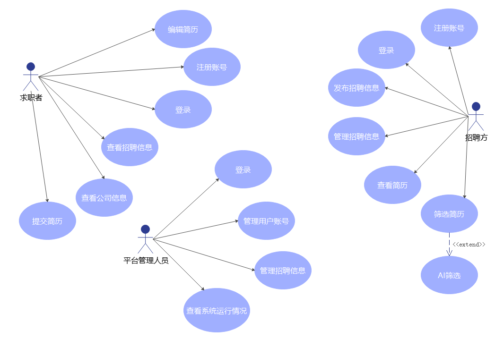

## （二）活动图

这一部分，我们用活动图描述两类核心操作：招聘方的招聘操作与求职者的求职操作。其中，求职者的求职操作包括：求职者填写简历；求职者查看招聘信息；求职者投递简历。

通过活动图可以得到招聘方招聘的过程如下：

1. **招聘方**：首先，招聘方需要在平台系统上进行登录操作。
   - 输入用户名和密码。
   - 点击登录后，系统会进行身份验证。

2. **系统验证身份**：根据招聘方提供的用户名和密码，系统会进行身份验证。
   - 如果验证失败，则会显示“登陆失败”。
   - 如果验证成功，则会显示“登陆成功”。

3. **筛选简历**：一旦登录成功，招聘方可以进行简历的筛选工作。
   - 招聘方需要筛选出符合职位要求的简历。

4. **填写招聘反馈**：筛选简历后，招聘方需要填写对候选人的招聘反馈。
   - 这可能包括对候选人的评价、面试结果等信息。

5. **提交和保存招聘反馈**：填写完招聘反馈后，招聘方需要点击提交。
   - 提交后，系统会保存这些招聘反馈。

6. **发送通知给求职者**：最后，系统会根据招聘方的反馈，发送相应的通知给求职者。
   - 这可能包括面试结果、录用通知或其他相关信息。

通过活动图可以得到求职者求职的过程如下：

1. **求职者**：
   - 首先，求职者需要输入用户名和密码。
   - 接着，求职者点击登录按钮。

2. **平台系统**：
   - 系统会验证求职者的身份。
   - 如果身份验证失败，求职者将无法登录。
   - 如果身份验证成功，求职者将登陆成功。

3. 登陆成功后，**求职者**可以进行以下操作：
   - 填写简历内容。
   - 选择想要报名的职位。
   - 点击报名按钮。

4. **平台系统**：
   - 保存职位报名信息。
   - 发送通知给招聘方。

5. **招聘方**：
   - 招聘方可以查询求职者的报名信息和简历。
   - 招聘方填写招聘反馈。

## （三）类图

(此小节存在过时内容，待进一步交流后更新！)

根据需求，绘制类图如下所示

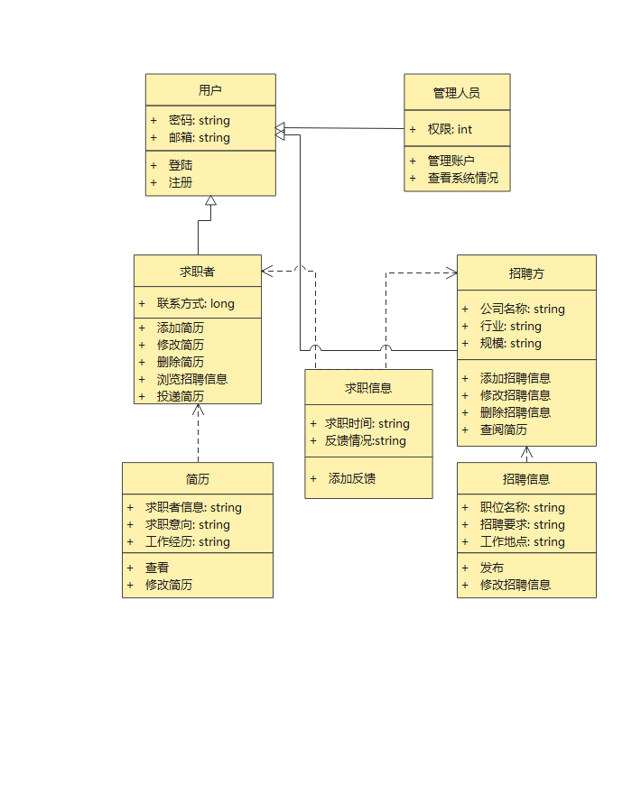

## （四）时序图

我们为招聘方的职位管理功能绘制时序图。这张时序图描述了招聘方用户在使用招聘系统时，进行职位管理的一系列操作流程：

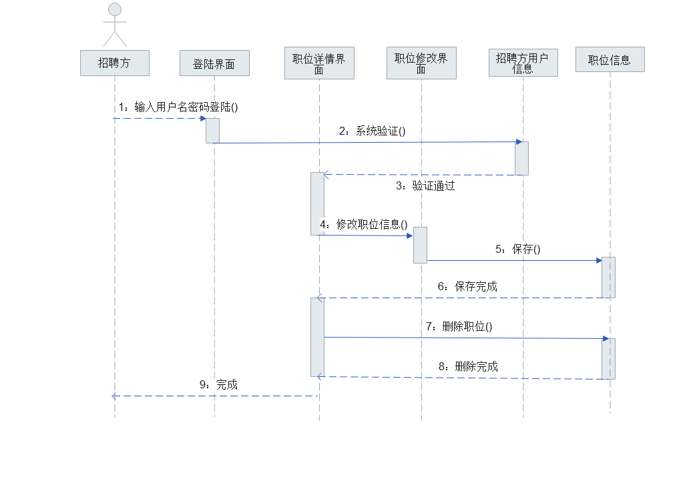

1. **登录系统**：招聘方首先登录系统。
2. **系统验证**：系统对招聘方登录信息进行校验。
3. **职位管理**：招聘方进入职位管理界面，进行职位信息的查看、修改或删除。
4. **保存修改**：招聘方修改职位信息后，点击保存。
5. **完成操作**：系统显示操作完成提示，职位信息更新或职位删除成功。

## （五）协作图——暂无

## （六）状态图

由于招聘、求职过程都围绕着职位展开，因此我们为职位绘制状态图，它描述了一个职位从创建到删除的整个生命周期，如下所示：

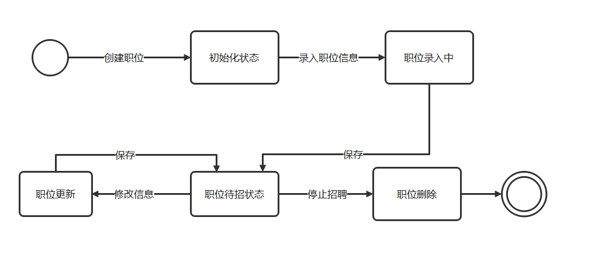

1. **创建职位**：这是职位生命周期的起始点，表示一个新职位的创建过程开始。

2. **初始化状态**：在创建职位之后，系统会进入一个初始化状态，可能用于设置一些基本的参数或默认值。

3. **录入职位信息**：在初始化之后，需要录入具体的职位信息，如职位名称、要求、薪资范围等。

4. **职位录入中**：表示正在录入职位信息的过程。

5. **保存**：录入完职位信息后，可以保存这些信息，使之成为正式的职位记录。

6. **职位更新**：当需要对职位信息进行更改时，可以进入职位更新状态，允许修改已有的职位信息。

7. **修改信息**：在职位更新状态下，可以修改职位的详细信息。

8. **职位待招状态**：表示职位已经准备好，正在等待合适的候选人申请。

9. **删除职位**：如果职位不再需要招聘或已经招到合适的人选，可以进入删除职位状态，准备将职位从系统中移除。

## （七）构件图——暂无

## （八）部署图

部署图详细展示了系统在物理层面的运行架构，包括硬件的布局以及软件如何在硬件上进行部署。

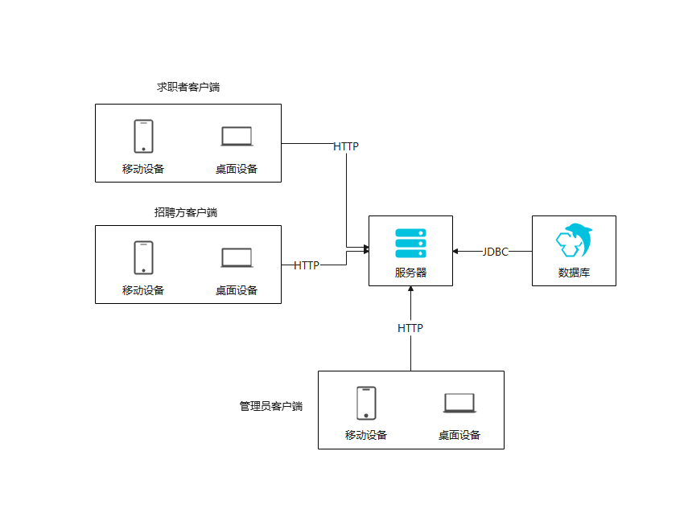

本系统采用集中式架构设计，从图中可以清晰地识别出硬件的配置和软件部署的详细流程：
- 求职者、招聘方和管理员端均能通过网页浏览器，利用HTTP协议通过互联网访问到Web服务器；
- Web服务器通过JDBC接口与数据库进行交互，实现数据的存储和检索；同时，通过输入输出操作与IO设备进行数据交换。

总体而言，部署图为我们提供了系统运行时的架构概览。

# 五、UI设计

在交互设计中，需要实现页面之间跳转的设计。在访问网站的时候，首先访问登录注册页面。用户根据自己的角色选择对应的登陆注册界面进行注册、登录，并根据自己登录的角色跳转到对应的首页。求职者身份会跳转到求职者首页，在求职者首页包含职位市场、个人简历、聊天消息等页面入口，在页面内部会包含相应的具体功能。招聘方身份会跳转到招聘方首页，在招聘方首页包含职位发布、公司信息、聊天消息的页面入口，在页面内部会包含相应的具体功能。管理员身份会跳转到管理员首页，管理员包含人员管理（管理求职者和招聘方）、内容审核管理功能页面用于管理职位内容。

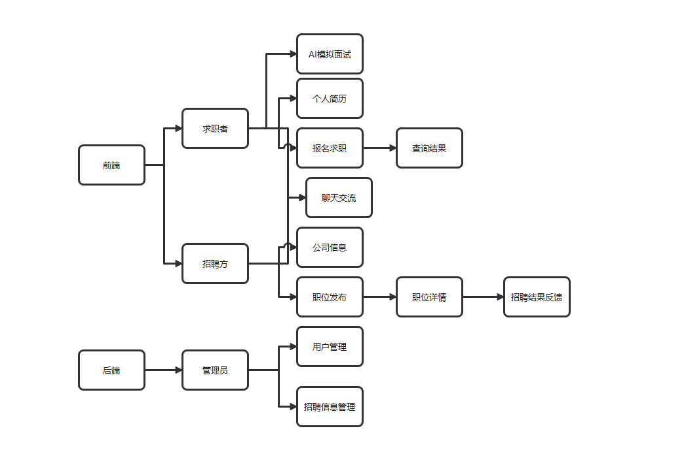

# 六、系统测试

（交由负责测试的同学书写）

# 七、 项目管理
本项目整体实现流程可以分为如下几个阶段：
1. 需求分析与系统设计：主要内容包括每周定时集体会议商量讨论方案，记录讨论内容
2. 系统各功能具体实现：主要内容包括五名成员在各自本地实现分配的代码功能。
3. 项目汇总整理：主要内容包括功能代码汇总、前后端测试、以及项目文档撰写。

本小组共有五名成员，在需求分析与系统设计的准备阶段，多为全组一起讨论，在系统各功
能具体实现和项目汇总整理部分的个人分工如下：

|王浩|张麟浩|王照钦|王昕炜|李铭辉|
|-|-|-|-|-|
|系统后端与项目代码汇总|系统前端|系统测试|PPT制作、视频录制与系统测试|界面设计、需求分析与文档撰写|

任务分配以及预期完成时间：
1. 需求分析与系统设计：5月20日-5月30日
2. 系统后端与项目代码汇总：5月31日-6月10日
3. 系统前端：6月11日-6月20日
4. 系统测试：6月21日-6月25日
5. PPT制作、视频录制与系统测试：6月26日-6月30日

# 八、用户手册

## （一）引言

### 1.编写目的

本章节旨在确立招聘网站的用户需求，明确这些需求在软件实现中的具体形态，以确保软件开发团队和用户对需求有一致且清晰的理解。本章向用户提供了一份详尽的招聘网站使用指南，包括功能、界面和操作的全面解释，旨在帮助用户深入理解并正确使用该软件。此外，本章还提供了逐步指导，以协助新用户迅速掌握软件功能和界面，降低学习成本。

用户手册详尽地描述了软件的所有功能，并定义了软件运行所需的期望环境和设备条件。它规范了软件的使用流程，可以作为用户操作指导、软件分析的参考以及软件测试的基准。本手册的目标读者群体包括用户代表、软件分析人员、开发管理人员和测试人员。

### 2. 背景

1. 本用户手册所描述的软件系统的名称为：招聘网站
2. 本软件项目的提出者：
3. 本软件项目的开发者：
4. 本软件项目的目标用户：所有需要招聘和求职的互联网使用者

### 3. 定义

**招聘网站** 是一个在线平台，它为求职者和雇主提供了一个便捷的互动空间。在这个平台上，求职者可以上传和更新他们的简历，利用关键词、行业类别、工作地点等条件来搜索和申请他们感兴趣的职位。同时，雇主则可以发布职位信息，展示公司文化和工作环境，吸引合适的候选人。招聘网站可以根据用户的求职偏好来推荐职位，提高求职效率。

### 4. 参考资料
1. [《软件工程—实践者的研究方法》Roger S.Pressman,Bruce R.Maxim 编著](http://images.china-pub.com/ebook40001-45000/41206/ch01.pdf)
2. [《用户手册 GB8567-88 国家标准》](https://www.antpedia.com/standard/74250-1.html)
3. [人机交互: 以用户为中心的设计和评估（第6版）](http://www.tup.tsinghua.edu.cn/booksCenter/book_08468901.html)

## （二）用途

### 1. 功能
此处仅介绍主要功能，更多详细界面功能演示见演示视频。

**求职者端**
1. 注册功能：  
求职者输入自己的个人信息，拖动滑块进行注册，注册成功会显示提示弹窗。  
。。。。。图片待前端的同学补充。。。。。
2. 登录功能：  
求职者输入自己的个人信息，拖动滑块进行登录，登录成功会显示提示弹窗。  
。。。。。图片待前端的同学补充。。。。。
3. 个人信息修改功能：  
求职者登录之后可在个人中心实现个人信息的修改，修改密码等操作。  
。。。。。图片待前端的同学补充。。。。。
4. 简历修改功能：  
求职者登录之后可在简历页面修改简历内容并保存。  
。。。。。图片待前端的同学补充。。。。。
5. 报名求职功能：
求职者可以在职位市场页面选择理想的职位，报名求职并提交简历。
6. 求职结果查询功能：  
求职者求职后可在职位详情页查看求职结果，结果由招聘方反馈，求职结果会在聊天页面同步通知。
7. 聊天功能：  
求职者登录之后可在聊天页面与招聘方、其他求职者交流，支持文字和图片形式。
8. 模拟面试功能：  
求职者登录之后可在聊天页面选择AI助手进行模拟面试，帮助提升面试技巧。

**招聘方端**
1. 登录功能：  
招聘方由管理员统一录入信息，输入个人信息，拖动滑块进行登录，登录成功会显示提示弹
窗。
2. 个人信息修改功能：  
招聘方登录之后可在个人中心实现个人信息的增删改查，修改密码等操作。
3. 公司信息功能：  
招聘方登录之后可在公司信息页面实现修改公司的信息。
1. 职位管理功能：  
招聘方进入职位发布界面，可以填写职位信息并发布。已发布的职位可以进入详情页面，进一步修改信息或在招聘结束后删除职位。
1. 招聘功能：  
招聘方进入职位详情界面，可以查看投递的简历，可以筛选出符合要求的简历，选择合适简历后反馈面试信息，并对剩余简历批量回复婉拒消息。

**管理员端**
1. 登录功能：  
管理员输入个人信息，拖动滑块进行登录，登录成功会显示提示弹窗。若忘记密码可以点
击界面底部提示，向邮箱发送邮件进行找回。
2. 个人信息增删改查功能：  
管理登录之后可在个人中心实现个人信息的增删改查，修改密码等操作。同时它还可以增
删改查求职者、招聘方的个人信息和权限。

### 2. 性能

**精度**  
本项目的数据包括求职者数据、招聘方数据、职位数据、求职数据、聊天记录数据。其中求职者数据由个人基本数据、简历数据构成，招聘方数据由个人基本数据、公司信息数据构成。其精度说明如下：
1. 求职者数据
  - 姓名：字符串类型，通常是以中文字符表示。
  - 身份证号码：字符串类型，需符合身份证号码的格式要求。
  - 性别：字符类型，通常是” 男” 或” 女”。
  - 出生日期：日期类型，通常以”YYYY-MM-DD” 的格式表示。
。。。。。待后端的同学补充。。。。。
2. 招聘方数据  
。。。。。待后端的同学补充。。。。。
3. 职位数据  
。。。。。待后端的同学补充。。。。。
4. 求职数据  
。。。。。待后端的同学补充。。。。。
5. 聊天记录数据  
。。。。。待后端的同学补充。。。。。

**时间特性**  
招聘网站时间特性如下：
- **响应时间** 所有功能的响应时间应在 1∼2 秒内
- **更新处理时间** 基于系统规范的设计，软件更新、修复的复杂性较低，软件更新的打包、发布过程相对简单，因此更新处理时间短，较为迅速
- **数据传输时间** 软件数据源存储在本地，故软件具有较快的数据传输时间为保证软件具有良好的用户体验，所有功能的实现在保证安全性，和正确性的情况下，应将响应时间降到最低。

**灵活性**  
当需求发生某些变化时，招聘网站对这些变化的适应能力的具体情况如下：
1. 操作方式的变化 本软件具有非常清晰的编程框架与结构，能够很好地应对操作方式需求的变化，例如从网页版调整为手机界面操作软件
2. 运行环境变化 本软件能够在 64-bit windows10 及以上版本操作系统中运行
3. 对软件需求的变化 本软件编程结构清晰，面对用户对软件功能需求的变化能够拥有足够的灵活性，适应需求变化所带来的不同场景和要求
4. 时间特性 运行环境的改变不影响软件的响应时间以及数据传输速率

### 3. 安全保密性
1. 用户密码输入时界面均显示为加密状态，防止窥屏。
2. 用户密码存储时，采用 pbkdf2_sha256 算法迭代 180000 次，防止用户密码泄露。
3. 应用程序应对用户输入进行验证和过滤，以防止恶意输入和攻击，如注入攻击、跨站脚本攻击等
4. 三类用户职责分明，用户无法实现越权的任何操作，实现了数据的安全与保密。

## （三） 运行环境
1. 硬设备
   1. 处理器 12th Gen Intel(R) Core(TM) i7-1260P 2.10 GHz
   2. 系统类型 64 位操作系统基于 x64 的处理器
2. 支持软件
   1. 操作系统 Linux 20.04
   2. 编译系统 Python 3.6 + Django 3.0 + Node.js 14.0
   3. 浏览器 推荐 Edge、Google、FireFox
3. 数据结构  
本软件采用的持久存储方案为数据库存储，采用 SQLite 数据库对用户信息、职位信息、求职记录等进行存储，数据库基表如下图所示：

。。。。。待后端的同学补充。。。。。

## （四） 使用过程
1. 安装与初始化  
    - 项目部署环境具体参数 
      1. Python 3.6.0
      2. Django 3.3.0
      3. Node.js 14.0
      4. SQLite Studio 3.4.3
    - 项目部署流程
      1. 对于项目前端而言：
        - 使用 npm run install 安装依赖
        - 使用 npm run serve 运行前端环境
      2. 对于项目后端而言：
        - 使用 pip install -r requirements.txt 安装依赖
        - 使用 python manage.py migrate 迁移数据库
        - 使用 python manage.py runserver 运行后端环境

2. 输入输出  
本小节中介绍系统主要功能的输入输出：  
。。。。。待前端的同学补充。。。。。

3. 文卷查询  
本软件所有用户数据、职位数据、求职数据都是基于软件的所有查询操作，无需用户额外输入查询参数。用户参数在用户登录时获取完成，采用隐式传参的方式在服务器端进行执行数据的查询。由于软件数据以数据库基表的形式进行存储，所以数据查询本质上采用 SQL 语句完成。
4. 出错处理和恢复  
软件客户端在正常运行的下，一般不会出现问题。多数问题出现在服务端，当服务器端无法访问，或服务端运行崩溃时，将短暂关闭服务器端。在关闭服务端后，用户使用软件会获取到服务无法访问等相关提示。当软件出现卡顿，崩溃等情况，强制关闭即可。服务端会在修复后进行重启，用户重启软件即可正常使用服务。为保证系统的稳定性，我们会定期进行压力测试，稳定性测试，确保用户能够及时获取服务。
5. 终端操作  
本软件基于 C/S 模式，采用客户端服务器模式开发，软件在各终端独立运行，无需终端之间连接，各终端与服务器独立通信。终端在进行修改操作时，服务器采用事务处理原则，遵从事务处理原子性，保证用户数据的准确性。服务器具有一定的并行能力，支持多终端同时访问。

# 九、项目部署环境具体参数

（参考）

# 十、项目GitHub地址

https://github.com/want6to6good/softwore-work/tree/main

# 十一、项目功能截图

项目具体功能实现的截图见讲解视频，此处不重复叙述。

# 十二、代码功能介绍

（交由负责前后端的同学书写）

# 十三、总结

在本学期的软件工程大作业中，我和团队共同合作完成了一个招聘平台网站，采用了Django+Vue框架，实现了前后端分离的架构。该平台不仅满足了求职者和招聘方要求的基本功能，如职位发布、简历投递求职、招聘结果反馈等，还针对求职者需求额外设计了大模型模拟面试功能，以便求职者提升面试能力。

我们在项目开发过程中，进行了前期调研分析，编写了前后端单元测试，并完成了功能和性能测试。为了保证用户信息的安全性，我们采用了pbkdf2_sha256算法进行密码存储。

整个项目开发过程使我们深刻体验到了软件工程的全过程，从需求分析、功能设计、实现、代码合并，到测试和文档撰写等多个环节。这不仅锻炼了我们的软件工程能力，还增强了团队合作意识，收获了知识和友谊。
